# Práctica 1: Spring Boot - Instalación y Configuración

## 10. Resultados y Evidencias

### 1. Verificación de Java
Comando:
```bash
java -version

```
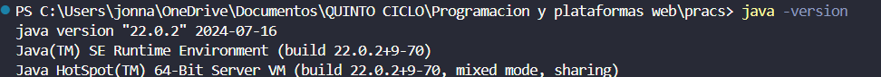


### 2. Servidor Spring Boot ejecutándose
Salida de consola:
```
:: Spring Boot :: (v4.1.0)

Tomcat started on port 8080

Started Fundamentos01Application in 3.659 seconds
```

### 3. Endpoint `/api/status` funcionando
Acceso: `http://localhost:8080/api/status`
Respuesta JSON:
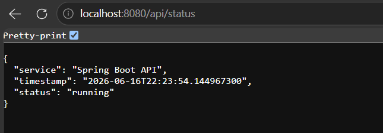


### 4. Estructura del proyecto - Controlador creado
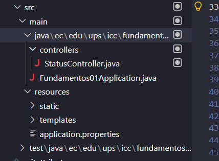

**Funcionamiento del endpoint:**
El controlador `StatusController` utiliza la anotación `@RestController` para exponer un endpoint HTTP GET en la ruta `/api/status`. El método `status()` devuelve un `Map` que se serializa automáticamente a JSON por Spring Boot. La anotación `@GetMapping("/api/status")` mapea las solicitudes HTTP GET a este método específico.

**Función de Spring Boot:**
Spring Boot proporciona un servidor embebido (Tomcat) integrado que se inicia automáticamente junto con la aplicación. Esto elimina la necesidad de configurar servidores externos. La auto-configuración de Spring Boot detecta automáticamente las dependencias (spring-boot-starter-web) e inicializa el servidor en el puerto 8080 por defecto, permitiendo que la aplicación sea un servicio autónomo desplegable como un único archivo `.jar`.
# Práctica 2: Spring Boot - Estructura del Proyecto y Arquitectura Modular

## 11. Resultados y Evidencias

### 1. Captura del IDE mostrando la estructura modular

**Visualización de la estructura en VSCode/IntelliJ:**


**Estructura visible:**
-  Paquete raíz: `ec.edu.ups.icc.fundamentos01`
-  Módulo `products/` con carpetas: `controllers/`, `services/`, `repositories/`, `entities/`, `dtos/`, `mappers/`
-  Módulo `users/` con la misma estructura
-  Módulo `auth/` con la misma estructura
-  Carpetas globales: `config/`, `utils/`
-  Archivo principal: `Fundamentos01Application.java`

---

### 2. Captura del archivo `Fundamentos01Application.java`

**Ubicación:** `src/main/java/ec/edu/ups/icc/fundamentos01/Fundamentos01Application.java`


**Código:**
```java
package ec.edu.ups.icc.fundamentos01;

import org.springframework.boot.SpringApplication;
import org.springframework.boot.autoconfigure.SpringBootApplication;

@SpringBootApplication
public class Fundamentos01Application {

	public static void main(String[] args) {
		SpringApplication.run(Fundamentos01Application.class, args);
	}

}
```

**Verificación:**
-  Package raíz correcto: `ec.edu.ups.icc.fundamentos01`
-  Anotación `@SpringBootApplication` que activa `@ComponentScan`
-  Ubicación permite que Spring detecte todos los controladores y servicios en los subpaquetes

---

### 3. Explicación breve: ¿Por qué es importante tener módulos separados?

**Respuesta:**

Tener módulos separados es importante porque:

1. **Escalabilidad**: Cada módulo (products, users, auth) es independiente. Cuando la aplicación crece, se pueden agregar nuevos módulos sin afectar los existentes.

2. **Mantenibilidad**: El código es más fácil de entender y modificar cuando está organizado por dominios. Un desarrollador que trabaja con productos no afecta el código de usuarios.

3. **Reutilización**: Los servicios de cada módulo pueden ser reutilizados por múltiples controladores, evitando duplicación de código.

4. **Trabajo en equipo**: Diferentes desarrolladores pueden trabajar en módulos diferentes simultáneamente sin conflictos.

5. **Testabilidad**: Cada módulo puede probarse de forma aislada, facilitando las pruebas unitarias e integración.

6. **Separación de responsabilidades**: Cada carpeta tiene una función clara:
   - `controllers/`: reciben solicitudes HTTP
   - `services/`: lógica de negocio
   - `repositories/`: acceso a datos
   - `entities/`: modelos de datos
   - `dtos/`: transferencia de datos

Esta estructura sigue patrones profesionales de arquitectura backend y es la estándar en aplicaciones empresariales reales.
# Práctica 3: Spring Boot - API REST y CRUD con DTOs y Mappers


## 10. Resultados y Evidencias


### 6. Pruebas en Postman - GET /api/products (con 3 productos)

**Request:**
```
GET http://localhost:8080/api/products
```


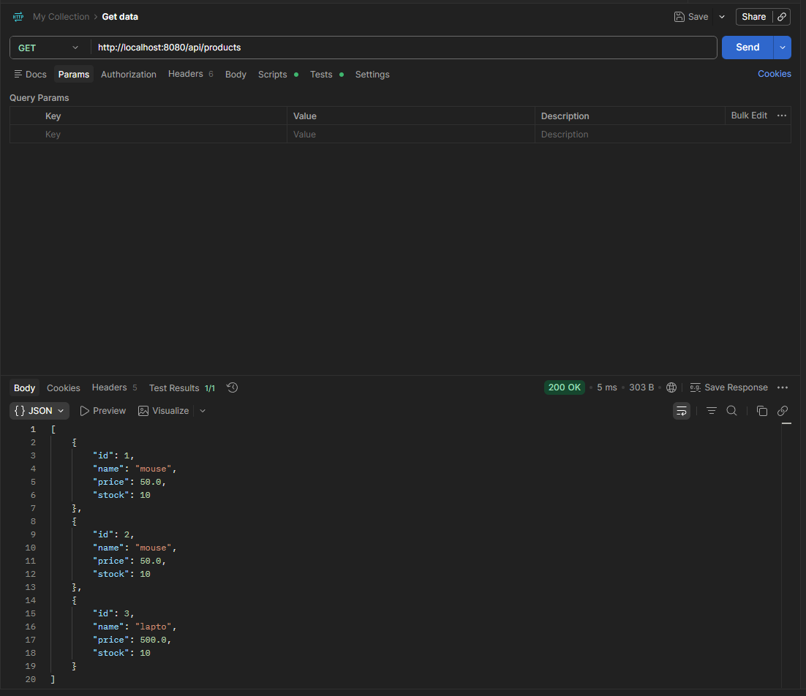

---

### 7. Pruebas en Postman - GET /api/products/{id} (producto existente)

**Request:**
```
GET http://localhost:8080/api/products/1
```


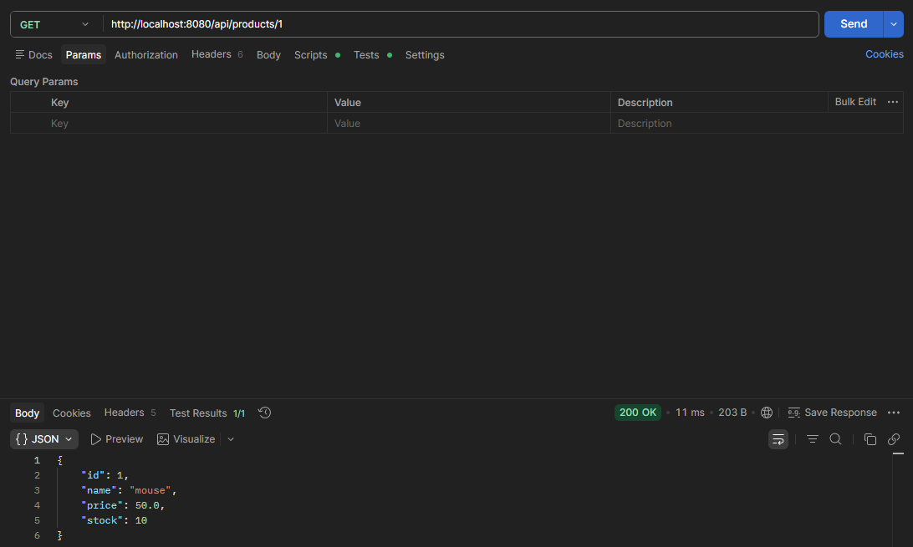

---

### 8. Pruebas en Postman - DELETE /api/products/{id} (producto existente)

**Request:**
```
DELETE http://localhost:8080/api/products/2
```


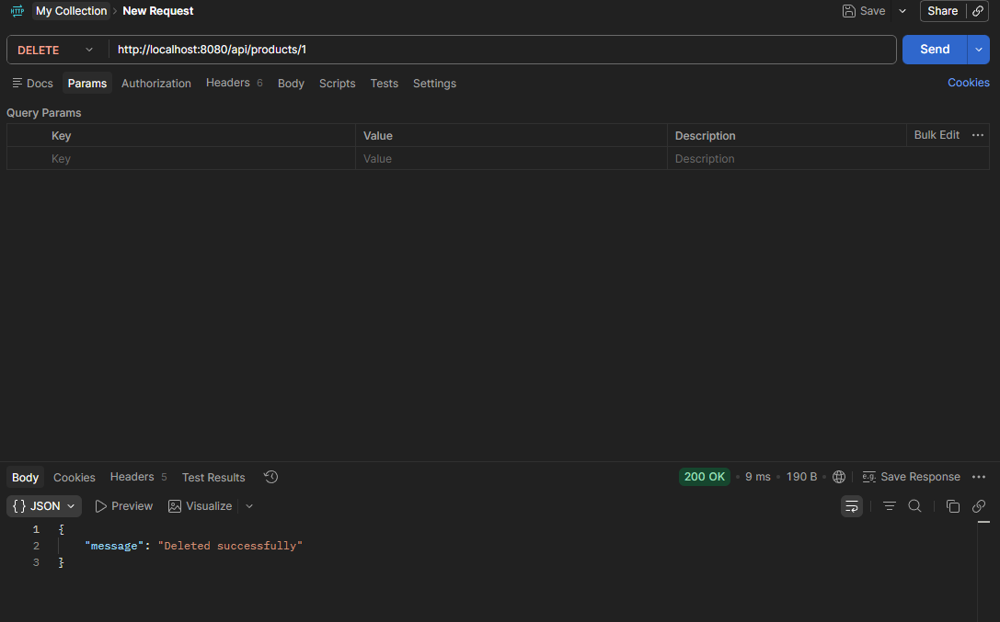

---

### 9. Pruebas en Postman - DELETE /api/products/{id} (producto no existente)

**Request:**
```
DELETE http://localhost:8080/api/products/999
```

**Respuesta:**
```json
{
  "error": "Product not found"
}
```

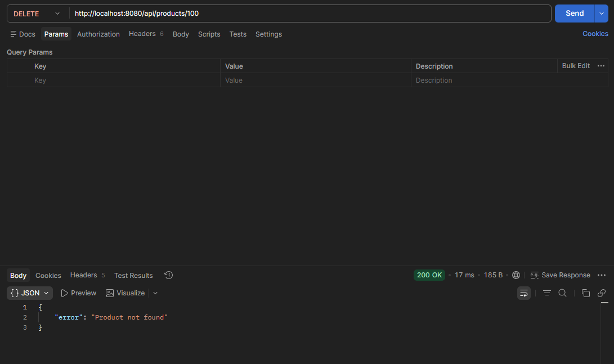

---


# Práctica 4: Spring Boot - Servicios e Inyección de Dependencias

## 8. Resultados y Evidencias

### 1. Captura de ProductServiceImpl.java

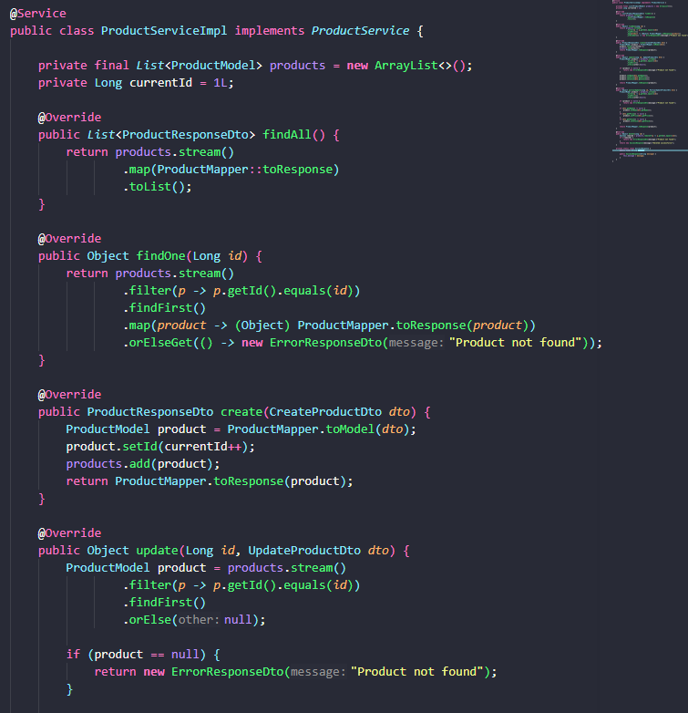


---

### 2. Captura de ProductsController.java

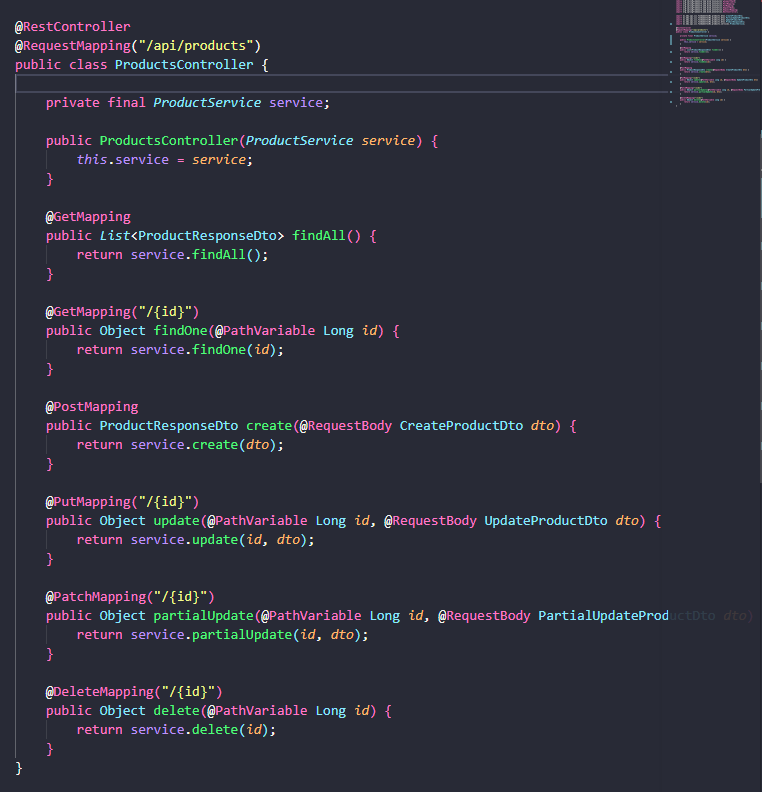


---

### 3. Explicación breve: ¿Cómo se inyecta el servicio en el controlador?

**Inyección de Dependencias por Constructor:**

1. **Spring detecta la dependencia:**
   ```java
   private final ProductService service;
   ```

2. **El controlador solicita la inyección mediante constructor:**
   ```java
   public ProductsController(ProductService service) {
       this.service = service;
   }
   ```

3. **Spring busca una implementación de `ProductService`:**
   - Encuentra `ProductServiceImpl` porque tiene anotación `@Service`

4. **Spring crea automáticamente la instancia y la inyecta:**
   - No necesitamos hacer `new ProductServiceImpl()`
   - Spring lo hace por nosotros

5. **El controlador usa el servicio:**
   ```java
   @GetMapping
   public List<ProductResponseDto> findAll() {
       return service.findAll();  // Delega al servicio
   }
   ```

**Ventaja:** El controlador queda limpio y solo coordina, no implementa lógica.

# Práctica 5: Spring Boot - Persistencia con PostgreSQL, JPA y Repositorios

## 20. Resultados y Evidencias

### 1. Captura de 5 productos creados en PostgreSQL

**Consulta ejecutada:**
```sql
SELECT * FROM products;
```

**Captura desde terminal psql, DBeaver o VS Code PostgreSQL:**

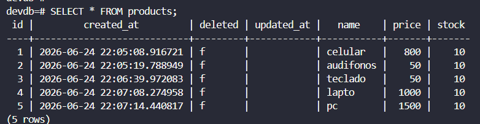

**Evidencia visible:**
-  Tabla `products` con 5 registros
-  Columnas: id, name, price, stock, created_at, updated_at, deleted
-  Datos persistidos en PostgreSQL

---

### 2. Explicación: Flujo de datos desde API REST hasta PostgreSQL y viceversa

#### **De Cliente a Base de Datos (Inserción):**

```
POST /api/products
  ↓
ProductsController
  ↓
ProductService.create(CreateProductDto)
  ↓
ProductMapper.toModelFromDTO(CreateProductDto) → ProductModel
  ↓
ProductMapper.toEntityFromModel(ProductModel) → ProductEntity
  ↓
ProductRepository.save(ProductEntity)
  ↓
BaseEntity @PrePersist: createdAt = NOW(), deleted = false
  ↓
PostgreSQL: INSERT INTO products (name, price, stock, created_at, deleted)
  ↓
Base de datos guarda registro con ID generado automáticamente
```

#### **De Base de Datos a Cliente (Lectura):**

```
GET /api/products
  ↓
ProductsController
  ↓
ProductService.findAll()
  ↓
ProductRepository.findAll() → List<ProductEntity>
  ↓
ProductMapper.toModelFromEntity(ProductEntity) → ProductModel
  ↓
ProductMapper.toResponse(ProductModel) → ProductResponseDto
  ↓
HTTP 200 OK con JSON de productos
  ↓
Cliente recibe datos
```

---

### 3. Rol de BaseEntity

**BaseEntity es una superclase que:**

-  **Centraliza campos comunes:** id, createdAt, updatedAt, deleted
-  **@MappedSuperclass:** No crea tabla propia, sus campos se heredan en UserEntity y ProductEntity
-  **@PrePersist:** Ejecuta `onCreate()` automáticamente antes de insertar → asigna createdAt y deleted=false
-  **@PreUpdate:** Ejecuta `onUpdate()` automáticamente antes de actualizar → asigna updatedAt
-  **@GeneratedValue(IDENTITY):** La base de datos genera el ID automáticamente, no el código

**Ventaja:** Ambas entidades (User, Product) heredan esta lógica sin duplicar código. Cualquier nueva entidad que extienda BaseEntity tendrá automáticamente auditoría de fechas y marca de eliminación lógica.


# Práctica 6: Spring Boot - Validación de DTOs y Control de Datos de Entrada

## 13. Resultados y Evidencias

### 1. Captura de respuesta de error al enviar un POST inválido

**Request inválido:**
```json
POST http://localhost:8080/api/products
{
  "name": "",
  "price": -5,
  "stock": -1
}
```

**Captura de la respuesta en Postman:**

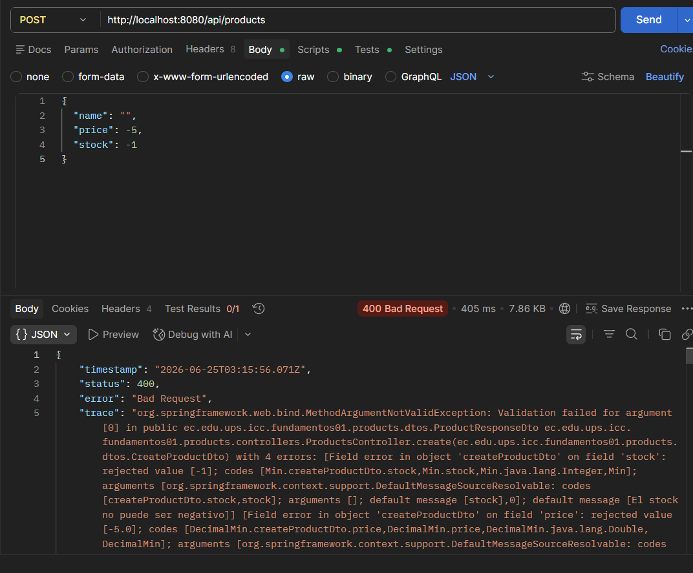

**Evidencia visible:**
- ✅ HTTP Status: `400 Bad Request`
- ✅ Validaciones activas:
  - `name` vacío → rechazado
  - `price: -5` → rechazado (debe ser > 0)
  - `stock: -1` → rechazado (no puede ser negativo)

---


#### **B. Crear producto válido**

**Request:**
```json
POST http://localhost:8080/api/products
{
  "name": "Monitor",
  "price": 250.00,
  "stock": 10
}
```

**Captura:**

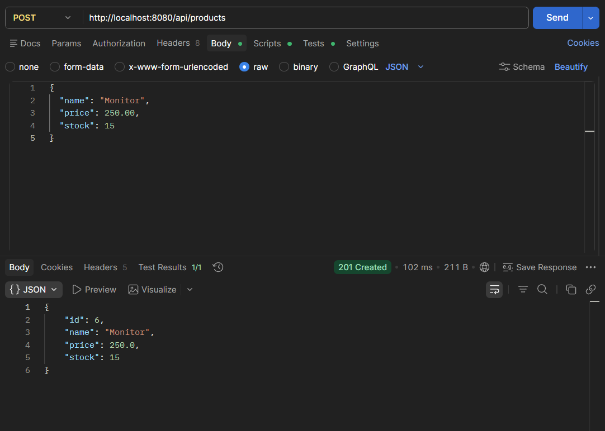

**Respuesta esperada:**
- ✅ HTTP 201 Created
- ✅ Producto guardado con id, createdAt, deleted=false

---


### 3. Resumen de validaciones implementadas

| Validación | Tipo | Ubicación |
|-----------|------|-----------|
| Nombre obligatorio | DTO | CreateProductDto |
| Nombre mín 3 caracteres | DTO | CreateProductDto |
| Precio obligatorio | DTO | CreateProductDto |
| Precio > 0 | DTO | CreateProductDto |
| Stock obligatorio | DTO | CreateProductDto |
| Stock ≥ 0 | DTO | CreateProductDto |
| No actualizar eliminado | Servicio | ProductServiceImpl |
| No devolver eliminados | Servicio | ProductServiceImpl.findAll() |
| Email único | Servicio | UserServiceImpl |